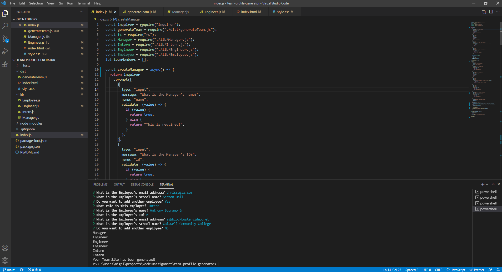

#  Team Profile Generator

##  Description

The Team Profile Generator is a console application that allows you to assemble a team web page using Inquirer. Testing was performed to verify the functionality of this application.

##  Table of Contents
* [Installation](#installation)
* [Usage](#usage)
* [Tests](#tests)
* [License](#license)
* [Contributors/Resources](#contributors/resources)
* [Questions](#questions)

##  Installation

Potential users will need to clone the code to their local machine as well as install inquirer in order for this application to work correctly.

##  Usage

Users are prompted to enter required team member data starting with the manager. Once the user has completed creating employees, the web page will be generated.

[Link to video demonstration](https://watch.screencastify.com/v/8hBEDbk2TvLUxlK1WZjy)

##  Tests

Jest was used for testing on the Employee, Manager, Engineer and Intern objects.

##  License

MPL_2.0

##  Contributors/Resources

Nigel Loch

##  Questions

If there are any questions about this project, please contact me at <nigelloch@gmail.com>. Thank you!

To see more of my projects, please visit my GitHub Repo at <https://github.com/nigelloch?tab=repositories>

  
